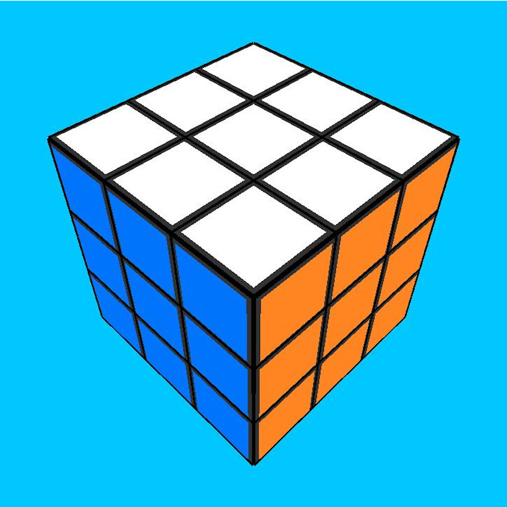

# JS Rubik Cube:
This project will provide all the logic in order to create a represent a fully functional Rubik's Cube.

## How to play:
There are 2 options:

- Download the repository (See the top right corner) as a .zip file. Once finnished, unzip it and open on your browser the file called "index.html"

- Follow the link "Play now". It will show a message similar to "Conection is not secure". Press "advance settings" and then "proceed to page"

### *[Play Now!](https://jkutkutarchive.github.io/JS-Rubik_Cube/)*

## Controls:

### Main menu:
In order to select the type of cube, use the mouse and click over the desired icon. The available options are:

- Normal: The classic cube appearance.
- Mirror: A version of the 3x3x3 mirror cube.
- Invisible: An invisible version where the user can only see the stickers of the cube.
- Stickerless: A version where the whole cube is filled completely, leaving no margins.

In order to select the dimension of the cube (3x3x3, 4x4x4...), use the mouse wheel.

Once the parametres are correct, press the start button in order to launch the game.

### Game:
Once the start button is pressed, the game will start.
- Camera movement: Use the mouse to drag the camera around the cube. Use the mouse wheel to zoom in and out.
- When the camera moves over a cube's face, the second canvas will show the face on the bottom right corner. Make the desired move using the mouse, dragging the desired piece.
- Whenever you want to take a screenshot, just press right click on the canvas and select "save image"

## Content:

- Main menu interface
- Rubik's cube logic
- Documentation

*See [credits](docs/credits.md) to thank all the help to make the interface*
